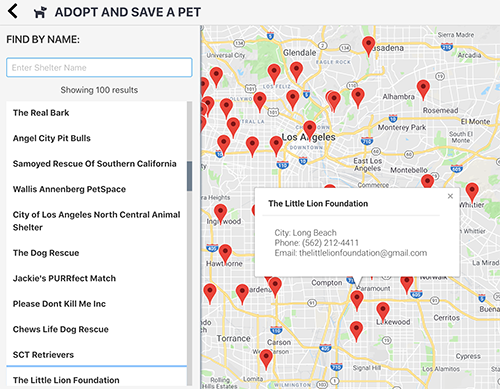
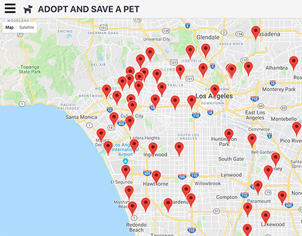

# Neighborhood Map : Animal Shelters

## Overview

This app was created for Project 7 of Udacity Front End Nanodegree program using React and is bootstrap with Create React App. It is a local map of animal shelters within and around Downtown Los Angeles.

[PetFinder's API](https://www.petfinder.com/developers/) is used for all the needed information. Markers are placed when map finishes loading. The list of shelters are sorted in real time as user types. Information about the shelter is displayed when the user clicks or keypress 'Enter'.

## Installation and Development

1. Download or clone this [repository](https://github.com/rleu82/reactMap)
2. Navigate to the directory where this repo was cloned or extracted
3. Run `npm install` to install all dependencies.
4. Run `npm start` to start the server at [localhost:3000](http://localhost:3000/)
5. Navigate to [Google](https://cloud.google.com/maps-platform/) and create and account and generate an api key for Google Maps Javascript API. (Place your maps key on line 358 MapContainer.js after "apiKey:")
6. Goto [PetFinder](https://www.petfinder.com/developers/api-key) and create an account and grab your api key. PetFinder's api key is used within the fetch url after `...&key=` and before `&count`.
   IE: `http://api.petfinder.com/shelter.find?format=json&key=YourKeyHere&count=100&location=${location}&callback=callback`

#### These steps are for production mode which is neccesary for the service worker to work

7. Enter `npm run build` to create a build of the project
8. Run `serve -s build` will serve the project. If serve isn't installed enter `npm install -g serve` before running `serve -s build`
9. Navigate to [localhost:5000](http://localhost:5000/) as listed on your terminal. \*Please note the port is `5000` for production mode.

## Dependencies

[google-maps-react](https://github.com/fullstackreact/google-maps-react) is used to lazy load google maps into project.

[escape-string-regexp](https://github.com/sindresorhus/escape-string-regexp)

[fetch JSONP](https://github.com/camsong/fetch-jsonp)

[Font Awesome](https://fontawesome.com/how-to-use/on-the-web/using-with/react)

[Hero Patterns](http://www.heropatterns.com/) - "Hideout" background svg by Steve Schoger under [CC BY 4.0](https://creativecommons.org/licenses/by/4.0/)
